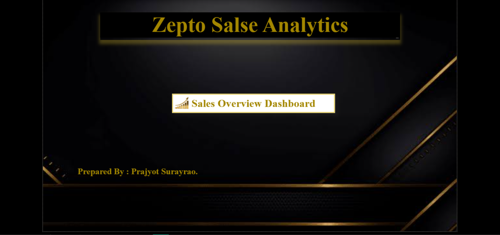
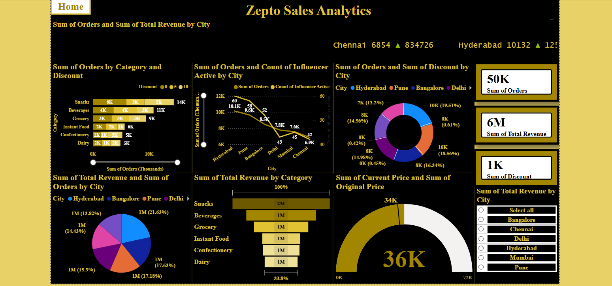

## 📊 Zepto-Sales-Analytics

## 📌 Project Overview

Zepto Sales Analytics is an interactive Power BI dashboard designed to analyze sales performance, orders, revenue, discounts, product categories, and city-level business activity.

The dashboard transforms sales data into meaningful visual insights that can help understand revenue performance, order trends, category performance, discount patterns, pricing differences, and geographical sales distribution.

The project was developed using Microsoft Power BI with interactive visualizations, KPI cards, slicers, and analytical charts.

## 🎯 Business Objectives
- Analyze overall sales and order performance.
- Track Total Revenue, Total Orders, and Total Discount.
- Identify product categories generating the highest number of orders.
- Compare order performance across cities.
- Identify cities contributing the highest revenue.
- Analyze revenue contribution by product category.
- Understand the relationship between discounts and orders.
- Compare Original Price vs Current Price to evaluate pricing and discount impact.
- Analyze influencer activity alongside city-level order performance.
- Provide an interactive dashboard to support data-driven business decisions.

## 🛠 Tools & Technologies Used
- Microsoft Power BI – Dashboard development and interactive data visualization
- Power Query – Data cleaning, transformation, and preparation
- DAX – KPI calculations and analytical measures
- Power BI Visuals – Bar Chart, Line Chart, Donut Chart, Pie Chart, Funnel Chart, and Gauge Chart
- GitHub – Project documentation and portfolio presentation

## 💡 Business Insights

The dashboard can be used to identify:

🏙️ City Performance

City-level analysis helps determine the locations with stronger order volumes and revenue contribution.

🛒 Category Performance

Category analysis helps businesses identify products or categories that contribute significantly to orders and revenue.

💰 Revenue Analysis

Revenue-by-city and revenue-by-category visuals provide a clear view of where business revenue is being generated.

🏷️ Discount Analysis

Discount information can be compared with orders to understand how promotional pricing may influence sales activity.

💵 Pricing Analysis

Comparing original and current prices provides visibility into pricing and discount impact.

📢 Influencer Activity

The dashboard includes influencer activity alongside city-level order analysis, allowing potential relationships between influencer activity and order performance to be explored.

## 🖼️ Dashboard Preview

### 1️⃣ Home Page

### 2️⃣ Sales Overview Dashboard

## 🚀 Business Impact
- Provides a single interactive view of Zepto's sales performance.
- Helps identify high-performing cities and product categories.
- Supports better pricing and discount strategy.
- Enables management to monitor revenue and order trends quickly.
- Helps evaluate the impact of discounts on customer orders.
- Provides insights into city-level business performance.
- Supports identification of potential opportunities for sales growth and optimization.
- Reduces dependency on manual reporting and enables faster, data-driven decision-making.

 ## 📁 Project File
The complete interactive dashboard is available in the `.pbix` file included in this repository.
